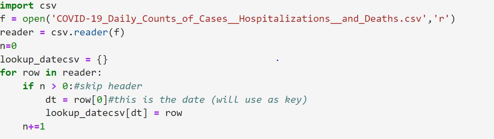
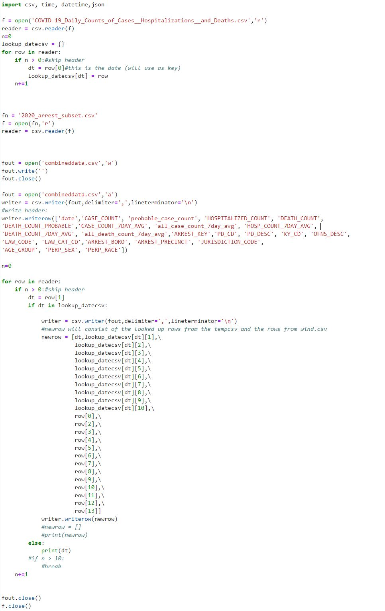
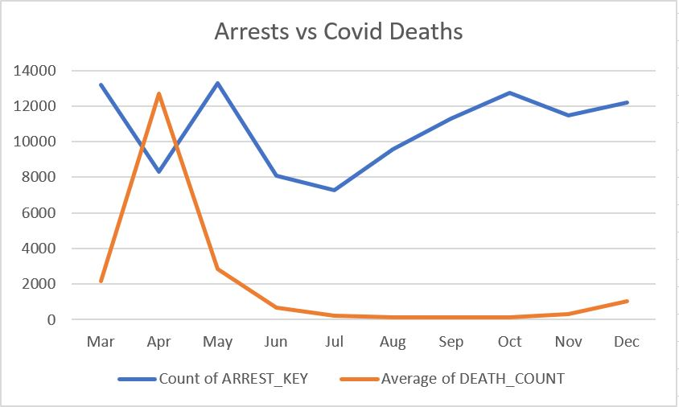
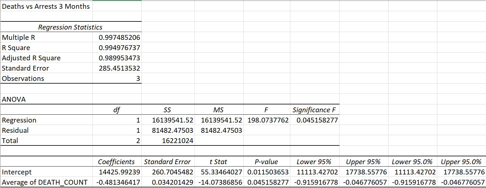
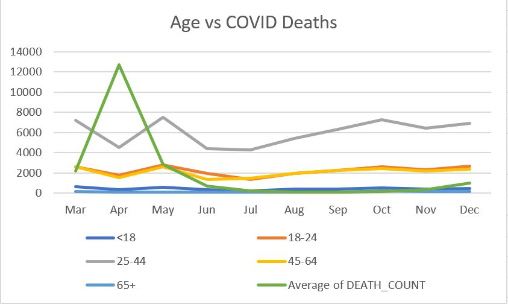
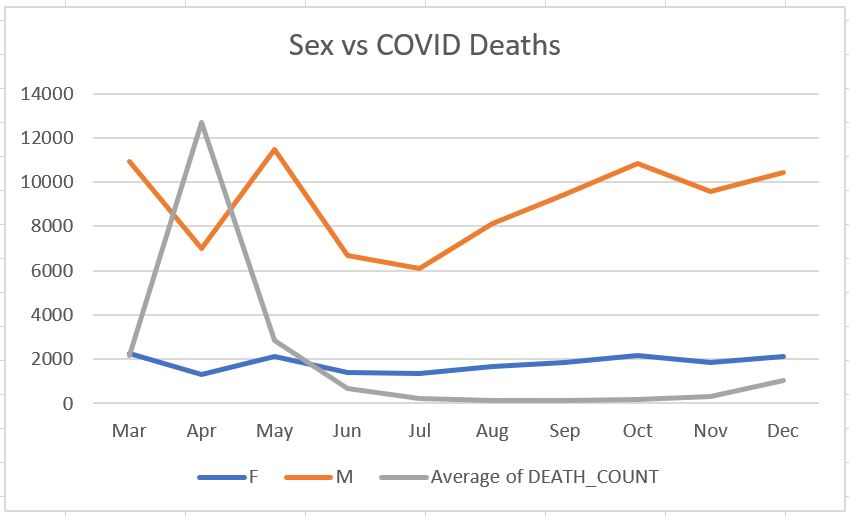
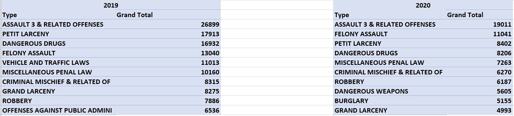

# IA 626 Final Project, NYC Arrests Data and NYC COVID Data

 # Table of contents
1. [Introduction](#introduction)
2. [What Data and Why?](#paragraph1)
3. [Parsing and Joining my Data](#paragraph2)
    1. [Getting Comfortable With My Data](#subparagraph1)
    2. [Subsetting My Data](#subparagraph2)
    3. [Joining My Data](#subparagraph3)
4. [Analyzing My Data](#paragraph3)
    1. [Arrests vs Cases](#subparagraph4)
    2. [Arrests vs Deaths](#subparagraph5)
    3. [Arrest Age Group vs Deaths](#subparagraph6)
    4. [Arrest Sex vs Deaths](#subparagraph7)
    5. [Arrest Type 2019 vs 2020](#subparagraph8)
    
## Introduction 
The following project outlines the procces of finding my data and why I chose the data sets I did. I will also outline the necessary steps I needed to take to filter my data in order to join them as well as the process I took to join them. Lastly I will discuss what my newly joined data showed and the analysis I created.

## What Data and Why? 
Understanding that my realistic ability to take two super complex data sets and filter them to something that allowed me to join them was limited, I decided to focus on one thing first, what kind of data would make for a good join? Throughout the semester I felt as though we had done a lot with dates, whther change the structure of them, finding MIN and MAX dates within data or creating subsets based of specific dates. Thus I decided that my data should at least have dates in both of them, as I knew I could match their structures up to join as well as filter uneeded data if one set contained too much. Second, I wanted the data to be something relevent to our current life and interesting to me, and whats more current and interesting than COVID? Not much right now, so with that I started to look for my first dataset, intitially I started at a national scale and had found some decent sets but then I started to think about what I would join that to, and another relevent thing to everyone is crime, so I started looking into national crime datasets, but that became such a large scope and size that it seemed a bit unreasonable. Knowing COVID and Crime would be a good route to go I just shrunk my scope a bit and focused on states. I decided to use New York and obviously the first thing that popped up when I searched "NY COVID Data", was the city. Because theres no such thing as New York outside the city apparatenly. So I rolled with it and found a nice NYC COVID data set, so next was arrest data and I was able to find a 1.1 million kb dataset about essentially all arrests made in NYC with quite a few variables. The two sets both had dates,and both were CSVs. I was entrigued to see how COVID impacted the number of arrests, as well as other atributes within each arrest.

## Parsing and Joining My Data 

### Getting Comfortable with my Data 
After dowloading my data I used a csv reader to read it into python and jupyter lab, once that was done I printed the first two lines of my data sets to see what the headers were and see how the actual data points looked as well as how they where formated. Again both datasets contained dates and they were both formated in the same mm/dd/yyyy format. The only difference was that my arrest data contained multiple rows of the same dates as multiple arrests happen on the same day, my COVID data had unique dates as it recorded cases, deaths, and so on for every day. This is was an important thing to remeber when formating my join later. I then found the MIN and MAX dates of my arrest data. The MIN date was 1/1/2006 and the Max date was 12/31/2020, for my Covid data it was 2/28/2020 and 11/7/21.
### Subsetting My Data 
Onece I realized that my arrest data was just too large and outside the scope I was looking for I decided to make two subsets of the data one for 2019 as a "control" and then my 2020 data that I would join my COVID data to. Again this was something we had done in class where I isolated the column or 'row' that contained my dates, split it by the "/" and then selected my years. I then used that to reference a variable that would be 2019 or 2020 depending on the data set I creating and said if the year in the data set is equal the the variable then write the row. once completed I had a set with all 2019 arrests and one with all 2020 arrests.
### Joining My Data 
With my new subset arrest data that matched up with with my covid data I now had to join them together off my dates. Referencing back to my earlier comment about unique dates and repeated dates, it was important to think about how I would join the two sets together. Meaning, I couldn't join my arrest data "TO" my covid data because for every one row of covid data there where multiple rows of arrest data because again, covid dates are unique and arrest dates are not. Thus I had to make sure I joined my covid data "TO" my arrest data such that for every row for arrest date there would be the same repeated row of COVID data that shared the same date. With that in mind I created a function for my covid data similar to that we made in class where if I typed print(lookup_datecsv['03/27/2020']), it would print out that row with all the info in it. I then created my joined file and created the first row on my own, making spefic columns and naming them. I chose to only join specific parts of each data set as I felt some of the fields were unecessary and irrelevent to my project. After picking and labeling which columns to include, I then set up the writer to write the date and use the function to write the data from the shared covid file and the data from the the arrest file. Once completed I had a csv file that showed 2020 arrest data as well as covid data for those dates. It is also important to note that it only joined on dates where there were boths arrests and COVID information, meaning for January and February before COVID was tracked there were no joined rows.
 

 

 
## Analyzing My Data 
With my new csv file I was able to open it into excel and create pivot tables. Excel is where I am a bit more well versed so I was able to work out a few kinks with the data. Meaning it wasnt as simple as picking the dates as a row and then cases and arrests as my values. What I ended up doing was taking the unique arrest key and counting each key, now my output would be the count of unique arrest keys which tranlates to total arrests. For covid cases or covid deaths it was a bit more tricky, what I had to do was take the average cases or deaths for each date and then just sum the averages to get my month total. This was reqequired because on one specific date there were multiple rows of the same covid data, so if I used average it would generate the correct count on that date. I went with this method because I believe it would take less time and prevent me from making mistakes when compared to using python to count for me. Once I had this figured out I was able to make some comparrisons between covid deaths and cases vs different arrest information.
### Arrests vs COVID Cases 
This comparison was initially the main one I thought about when starting this project. To be honest I thought there would be a more direct comparison. Initially there was a pretty strong correlation between the number of cases and the effect it had on the number of arrests made. I ran a regression on the first 3 months of data as well as the whole 10 months. The first 3 months vs arrests had a Multiple R of .89 but when compared to the whole time frame it drops down to .13. This to me shows that, at first covid cases did effect the number of arrests made, when cases went up, crime went down and when cases dropped back down arrest went back up. However, as time went on the correlation dissapeared and cases didnt effect arrests as much or nearly at all.

Regression for the first 3 months:  
y=(-.06)x + 15836 
 

 
 
Regression for the 10 months: 
y= 0.008x + 10408 
 

 
### Arrests vs COVID Deaths 
In this comparison it was a bit esier to use a double line graph to analyze the data because the ranges of the deaths by covid and number of arrests where closer together, you can also see that when covid spiked in april it had a pretty direct negative effect on arrests going from 13,000 arrests in March to 8,000 arrests in April, during that same perioid covid deaths went from 2,100 in March to 12,000 in April. I also ran the same kind of regression for deaths and the effect they had on arrests. The same conclusion can be drawn, during the first three months there is a strong negative corelation between number of deaths and number of arrests, but as time played out the correlation grew weaker.  
 

 
Regression for the first 3 months: 
y=(-.48)x + 14425 
 

 
 
Regression for the 10 months: 
y=(-.14)x + 11023
 

### Arrest Age Group vs COVID Deaths 
In my file I compared all of my arrests variables to both covid cases and covid deaths, in here I am only going to talk about the deaths compared to arrest data, I'm going with this route as it's easier to see, as the range of the data is closer. This allowed for more viewable graphs and better talking points.
 
Once I saw this age group variable in the arrest data I thought it would be interesting to see how each age group was effected. Initially I thought all groups would follow the same negative relationship with the death count. Although that wasnt 100% wrong there were some outliers and some that were more effected than others. The largest group that followed the trend was 25-44, and the group that followed it the least was <18. To me this would make sense as when covid came the more effected people were those that were older, and the risk of dying or getting sick went down as age went down. So, in the graph you see that <18 stays relitvly flat, while 25-44 spikes down as deaths spike up.
 

 
### Arrest Sex vs COVID Deaths 
This trend is similar to that of the age group trend, where the male arrests where more directly effected by covid deaths than female arrests. I belive this mainly comes from the fact the more men are arrested than females in general so it would make sense that female arrests stay rather flat when compared to male arrests, just due to the scale difference. It is also interesting to note that after july male arrests steadily increased until november until we had another rise in covid deaths.
 

 
### Arrest Type 2019 vs Arrest type 2020 
In this comparison I first looked into seeing how the type of arrest was effected by both case count and death count but it was really too merky to see anything that stuck out. So I decided to take my 2019 subest, create a table showing top 10 types and compare it to the 2020 top 10 types. "Assault 3 Related Offenses" remained the top type across both tables but the rest were different. The most suprising type tha came up on the 2020 table was burglary, it was 9th on the list and wasn't in the top 10 in 2019. When I think about this it really is bizarre, as most people were home in 2020, so to think that people would take that risk is suprising. My only thought for why this was is perhaps burglars were under the impression that commiting a crime at night was safer than during the day as there are less people on the streets at night. But the total for burglary in 2019 was 3,671 vs 2020 which was 5,155, which is one of the only types to increase between the two years. 
 
